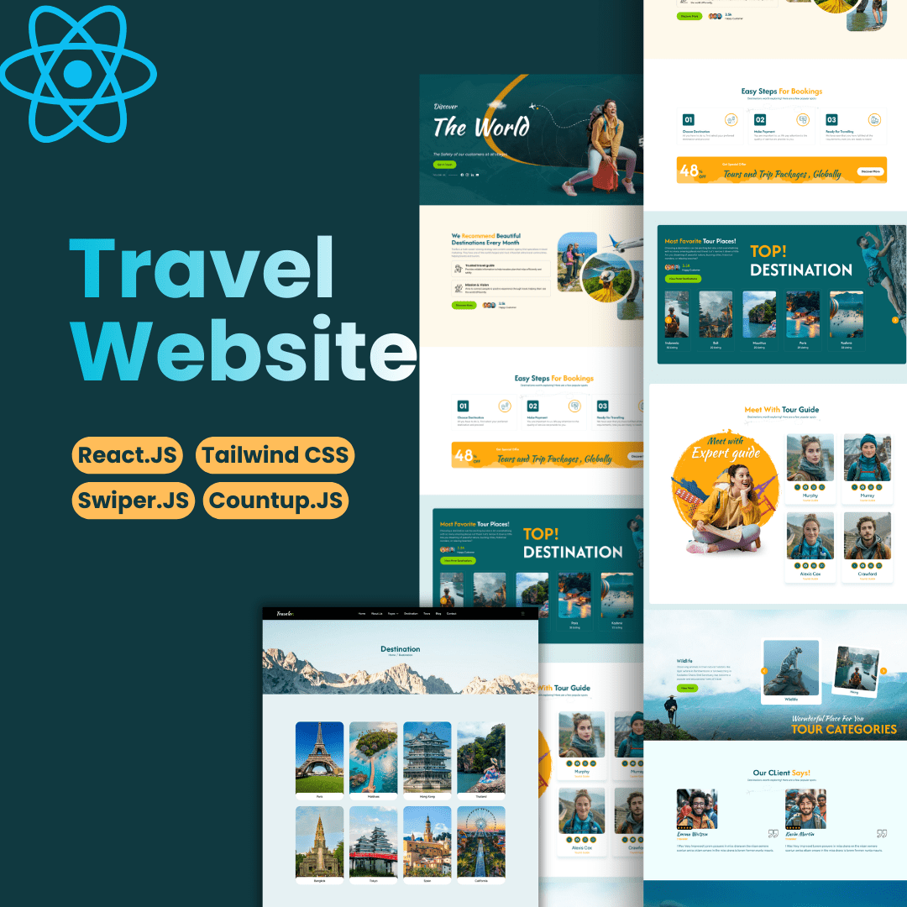

<div align="center">
  <br />
    <a href="https://travelor-one.vercel.app/" target="_blank">
      
    </a>
  <br />

# ✈️ Travelor

### A Multi-Page Travel & Tourism Website Built with React + Tailwind CSS v4

[](https://react.dev)
[](https://vite.dev)
[](https://tailwindcss.com)
[](https://reactrouter.com)
[](https://swiperjs.com)

> 🌍 _A fully responsive, component-driven travel agency website featuring custom CSS animations, interactive Swiper sliders, animated counters, and a full multi-page routing architecture._

<div align="center">
  <a href="https://travelor-one.vercel.app/" target="_blank">
    
  </a>&nbsp;
  <a href="https://santhosh-vs-portfolio.vercel.app" target="_blank">
    
  </a>&nbsp;
  <a href="https://github.com/Itssanthoshhere/Travelor" target="_blank">
    
  </a>
</div>

</div>

---

## 📋 Table of Contents

- [About The Project](#-about-the-project)
- [What I Learned](#-what-i-learned)
- [✨ Features](#-features)
- [🛠️ Tech Stack](#️-tech-stack)
- [🏗️ Project Structure](#️-project-structure)
- [🚀 Getting Started](#-getting-started)
- [🎯 Key Components](#-key-components)
- [🎨 Animation & Design System](#-animation--design-system)
- [⚡ Performance Notes](#-performance-notes)
- [🔮 Roadmap](#-roadmap)
- [🤝 Contributing](#-contributing)
- [📜 License](#-license)

---

## 📖 About The Project

**Travelor** is a production-quality, fully responsive travel and tourism website built entirely from scratch with React and Tailwind CSS v4. It was built as a **deep frontend study** to master:

- 🗺️ **Multi-page SPA routing** with React Router v7 and dynamic route parameters
- 🎠 **Advanced Swiper.js integration** — multiple slider configurations, custom navigation, autoplay
- 🎨 **Tailwind CSS v4** with CSS-first `@theme` configuration for a consistent design token system
- ✍️ **Hand-crafted CSS animations** — cloud parallax, car marquee, spinning tyres, hero slide, ripple pulse, hot air balloons, and more
- 📦 **Vite asset pipeline** — dynamic `new URL(..., import.meta.url)` image resolution for build-safe asset bundling
- 🧩 **Component architecture** — 30+ reusable components organized by feature and shared utility

> This project demonstrates how a complete, client-ready website can be built with no UI kit, no component library, and no animation framework — pure React, Tailwind, and hand-written CSS.

---

## 🧠 What I Learned

- How to structure large React projects with clear `components/` vs `Pages/` separation
- Tailwind CSS v4's new CSS-first `@theme` system and important modifier (`!`) syntax
- Vite's `new URL(..., import.meta.url)` pattern for dynamic image path resolution at build time
- Custom Swiper.js navigation with manual `ref`-based control and responsive `breakpoints`
- React Router v7 `useParams()` for detail pages with graceful not-found fallbacks
- Building reusable components (`MainBtn`) that switch between `<Link>` and `<button>` based on props
- Writing responsive CSS animations from scratch without any animation library

---

## ✨ Features

### 🦸 Hero Section

- Full-screen **MP4 video background** with a centered ripple play button
- Animated **"The World"** title with a continuous `translateX` slide effect
- Cloud parallax animations drifting across the hero
- Rotating orbital circle elements with dot accents
- Animated 50% discount badge with floating offer text

### 🗺️ Top Destinations

- **Expandable Swiper cards** — hovered slide grows from `w-65` to `w-125` via Tailwind transition
- Custom GSAP-style CSS transition on each slide
- Overlay customer avatar stack with count
- Smooth autoplay with custom yellow arrow navigation buttons

### 🎠 Tour Categories

- Side-by-side layout: description panel (left) + Swiper cards (right)
- **Active category sync** — description text swaps dynamically as swiper slides change via `onSlideChange`
- Cards tilt with `scale-75 rotate-6` on inactive slides, `scale-100 rotate-0` on active
- "View All" CTA card as the final slide

### 💬 Testimonials

- Auto-scrolling testimonial carousel with 2-up layout (responsive to 1-up on mobile)
- Star ratings, author images, and quote images per card

### 📊 Animated Counters

- Four stats counters (Awards, Travellers, Tours, Experience) using `react-countup`
- Triggered on component mount with configurable duration and decimal support

### 📰 Blog Section

- Dark section with a repeating pattern background
- Sorted by `publishedAt` for recency (index page shows latest 3)
- Full grid on `/blogs` route with hover scale on images

### 📄 13 Fully Routed Pages

| Route | Page |
|---|---|
| `/` | Home (Index) |
| `/about` | About Us |
| `/services` | Services grid |
| `/service/:id` | Service Detail (FAQ accordion, gallery Swiper, sidebar widgets) |
| `/testimonials` | All testimonials |
| `/tourguide` | Team grid |
| `/tourguide/:id` | Guide Detail (bio, skills, certifications) |
| `/faqs` | Accordion FAQ |
| `/pricing` | Pricing plans + 3-step booking |
| `/destination` | Destination grid |
| `/destination/:id` | Destination Detail (Swiper gallery, contact form) |
| `/tours` | All tours |
| `/tours/:id` | Tour Detail (day-wise itinerary, sidebar booking widget) |
| `/blogs` | All blog articles |
| `/contact` | Map embed + contact form |
| `*` | 404 (animated hot air balloon) |

### 🦶 Footer

- Animated **car marquee** with spinning tyres rolling across the bottom
- Parallax trees in the background
- Instagram gallery grid (9 images with hover Instagram icon overlay)
- Subscribe form with animated search button
- Full navigation links across Explore, Destination, and Legal columns

---

## 🛠️ Tech Stack

| Category | Technology | Version | Purpose |
|---|---|---|---|
| **Build Tool** | [Vite](https://vite.dev) | 8.0.12 | Fast HMR, native ESM, asset bundling |
| **UI Framework** | [React](https://react.dev) | 19.2.6 | Component-driven SPA |
| **Styling** | [Tailwind CSS v4](https://tailwindcss.com) | 4.3.0 | Utility-first with CSS-first `@theme` tokens |
| **Routing** | [React Router DOM](https://reactrouter.com) | 7.15.0 | Multi-page SPA routing + dynamic params |
| **Sliders** | [Swiper.js](https://swiperjs.com) | 12.1.4 | Hero, destination, category, testimonial carousels |
| **Icons** | [@iconify/react](https://iconify.design) | 6.0.2 | 6000+ SVG icons as React components |
| **Counters** | [react-countup](https://github.com/glennreyes/react-countup) | 6.5.3 | Animated number statistics |
| **Deployment** | [Vercel](https://vercel.com) | — | SPA hosting with rewrite rules |

### Fonts Used

| Font | Usage |
|---|---|
| `Poppins` | Body text, paragraphs, default |
| `Afacad` | Headings (h1–h6), section titles |
| `Figtree` | Links, anchor text, captions |
| `Kaushan Script` | Hero accent, decorative script headings |

---

## 🏗️ Project Structure

```
travelor/
│
├── 📁 public/
│   └── assets/                      # All static images organized by section
│       ├── Index/
│       │   ├── Hero/                # hero background, plane, clouds
│       │   ├── About/               # about images, icons
│       │   ├── TopDestination/      # destination card images
│       │   ├── TourGuide/           # team member photos
│       │   ├── TourCategories/      # category card images
│       │   ├── Testimonials/        # reviewer portrait images
│       │   ├── PopularToursPage/    # tour package images
│       │   ├── Blogs/               # blog post thumbnail images
│       │   ├── BookingSteps/        # step icons + title shape
│       │   ├── Counter/             # counter icon images
│       │   └── banner-video.mp4     # hero video background
│       ├── Destination/             # destination detail images
│       ├── ServicesPage/            # service gallery images
│       ├── TourGuidePage/           # full-page guide photos
│       ├── PricingPage/             # pricing card + step images
│       ├── PopularToursPage/        # tour detail icons (hotel, car, etc.)
│       ├── ErrorPage/               # 404 balloon + cloud images
│       ├── Footer/                  # Instagram gallery + car/tree assets
│       ├── AboutPage/               # about page specific images
│       ├── hotballon-Left.png
│       ├── hotballon-Right.png
│       ├── section-banner.jpg
│       ├── faq-media.png
│       └── con-sec-bg.jpg
│
├── 📁 src/
│   ├── 📁 Data/                     # Static JSON "database"
│   │   ├── Blogs.json               # 9 blog articles
│   │   ├── DestinationCtg.json      # 8 destinations (Paris, Maldives, Tokyo…)
│   │   ├── PopularTour.json         # 6 tour packages with day-wise itineraries
│   │   ├── Services.json            # 8 travel services
│   │   └── Teams.json               # 6 tour guide profiles
│   │
│   ├── 📁 components/
│   │   ├── 📁 Navbar/
│   │   │   ├── Navbar.jsx           # Scroll-aware sticky nav (transparent → black)
│   │   │   ├── 📁 Logo/
│   │   │   │   └── Logo.jsx         # Kaushan Script brand logo
│   │   │   └── 📁 NavMenu/
│   │   │       └── NavMenu.jsx      # Desktop dropdown + mobile slide-in drawer
│   │   ├── 📁 Footer/
│   │   │   └── Footer.jsx           # Full footer with car animation + Instagram grid
│   │   ├── 📁 Buttons/
│   │   │   ├── MainBtn.jsx          # Smart button: <Link> or <button> based on props
│   │   │   └── Toggle.jsx           # Hamburger menu icon
│   │   ├── 📁 BlogCard/
│   │   │   └── BlogCard.jsx         # Reusable blog thumbnail card
│   │   ├── 📁 DestinationCard/
│   │   │   └── DestinationCard.jsx  # Expandable swiper destination card
│   │   ├── 📁 DestinationCtgCard/
│   │   │   └── DestinationCtgCard.jsx # Category destination card with hover
│   │   ├── 📁 PopularTourCard/
│   │   │   └── PopularTourCard.jsx  # Tour package card with star rating
│   │   └── 📁 Index/                # All homepage section components
│   │       ├── Hero/Hero.jsx
│   │       ├── About/About.jsx
│   │       ├── BookingSteps/BookingSteps.jsx
│   │       ├── TopDestination/TopDestination.jsx
│   │       ├── TourGuide/TourGuide.jsx
│   │       ├── TourCategories/TourCategories.jsx
│   │       ├── Testimonials/Testimonials.jsx
│   │       ├── Banner/Banner.jsx
│   │       ├── Counter/Counter.jsx
│   │       ├── Tours/Tours.jsx
│   │       ├── Blogs/Blogs.jsx
│   │       └── Index.jsx            # Homepage compositor
│   │
│   ├── 📁 Pages/                    # Route-level page components
│   │   ├── About/About.jsx
│   │   ├── Blogs/Blogs.jsx
│   │   ├── Contact/Contact.jsx
│   │   ├── Destination/Destination.jsx
│   │   ├── Destination/DestinationDetails.jsx
│   │   ├── Faqs/Faqs.jsx
│   │   ├── Page404/Page404.jsx
│   │   ├── PricingPlan/PricingPlan.jsx
│   │   ├── Services/Services.jsx
│   │   ├── Services/ServicesDetails.jsx
│   │   ├── Testimonials/Testimonials.jsx
│   │   ├── TourGuide/TourGuide.jsx
│   │   ├── TourGuide/TourGuideDetails.jsx
│   │   ├── Tours/Tours.jsx
│   │   └── Tours/ToursDetails.jsx
│   │
│   ├── App.jsx                      # BrowserRouter + all Route definitions + ScrollToTop
│   ├── main.jsx                     # React DOM entry point
│   └── index.css                    # Tailwind v4 import + @theme tokens + all custom CSS
│
├── index.html                       # HTML shell with page title
├── vite.config.js                   # Vite + React + Tailwind v4 plugin config
├── vercel.json                      # SPA rewrite rule for client-side routing
├── package.json
└── eslint.config.js
```

---

## 🚀 Getting Started

### Prerequisites

Ensure you have the following installed:

```
Node.js >= 18.0.0
npm >= 9.0.0
```

### Installation

**1. Clone the repository**

```bash
git clone https://github.com/Itssanthoshhere/travelor.git
cd travelor
```

**2. Install dependencies**

```bash
npm install
```

**3. Start the development server**

```bash
npm run dev
```

Visit `http://localhost:5173` in your browser.

### Available Scripts

| Command | Description |
|---|---|
| `npm run dev` | Start development server with HMR |
| `npm run build` | Build for production to `dist/` |
| `npm run preview` | Preview the production build locally |
| `npm run lint` | Run ESLint across all source files |

### Production Build

```bash
npm run build
# Output: dist/ folder (ready to deploy)
```

### Deploy to Vercel (Recommended)

```bash
npm install -g vercel
vercel
# Follow prompts — select "Vite" framework preset
```

Or connect your GitHub repo directly at [vercel.com](https://vercel.com) for automatic deployments on every push.

> ⚠️ The `vercel.json` rewrite rule is required for client-side routing to work correctly on Vercel:
> ```json
> { "rewrites": [{ "source": "/(.*)", "destination": "/index.html" }] }
> ```

---

## 🎯 Key Components

**1. `<Navbar />`**

Scroll-aware sticky navigation:

- Transparent background on the homepage hero, switches to `bg-black` when scrolled > 50px or on any non-home route
- Desktop: horizontal nav with a multi-level dropdown ("Pages" → hover submenu → "Tour Guide" → nested hover submenu)
- Mobile: full-height slide-in drawer from the left with animated accordion submenus

```jsx
// Scroll detection
useEffect(() => {
  const onScroll = () => setScrolled(window.scrollY > 50);
  window.addEventListener("scroll", onScroll);
  return () => window.removeEventListener("scroll", onScroll);
}, []);

const isHome = location.pathname === "/";
// transparent only when at top of homepage
```

**2. `<MainBtn text rightIcon to className />`**

Polymorphic CTA button that renders as a React Router `<Link>` when a `to` prop is passed, or as a plain `<button>` otherwise. Shared across all pages with a consistent shimmer hover animation.

```jsx
// Smart render logic
if (to) return <Link to={to} className={`main-btn ${className}`}>{text}</Link>;
return <button type={type} className={`main-btn ${className}`}>{text}</button>;
```

**3. `<TourCategories />`**

The most interactive homepage section. Manages:

- `activeIndex` state synced to Swiper's `onSlideChange` event
- Description panel updates dynamically to show the active category's title and body
- Inactive cards visually "lean back" with `scale-75 rotate-6` while the active card stands upright

```jsx
<Swiper
  onSlideChange={(swiper) => setActiveIndex(swiper.realIndex)}
>
  {categories.map((cat) => (
    <SwiperSlide>
      <div className={activeIndex === index ? "scale-100 rotate-0" : "scale-75 rotate-6"}>
        ...
      </div>
    </SwiperSlide>
  ))}
</Swiper>
```

**4. `<ToursDetails />`**

Dynamic tour detail page with:

- `useParams()` + JSON lookup with a not-found guard
- Full Swiper image gallery with custom navigation arrows
- Day-wise itinerary built by iterating `Object.entries(tour.daysDescription)`
- Sticky right-side booking widget on desktop with package inclusions

**5. `<Counter />`**

Animated stats section using `react-countup` with a safe ESM import fallback:

```js
// Handles react-countup ESM/CJS export ambiguity
const CountUp = CountUpLib?.default || CountUpLib;
```

---

## 🎨 Animation & Design System

### Design Tokens (`index.css` `@theme` block)

```css
@theme {
  --color-prim: #85d200;       /* CTA green */
  --color-secondary: #066168;  /* Brand teal-dark */
  --color-yellow: #ffaa0d;     /* Accent yellow */
  --color-yellow-light: #fef9eb; /* Warm backgrounds */

  --font-poppins: "Poppins", sans-serif;
  --font-afacad: "Afacad", sans-serif;
  --font-figtree: "Figtree", sans-serif;
  --font-kaushan: "Kaushan Script", cursive;
}
```

### Custom CSS Animations

| Animation | Element | Technique |
|---|---|---|
| `slide-left` | Hero title "The World" | `translateX` infinite alternate-reverse |
| `cloud-animation` | Hero clouds | `translateX(-200px → 100vw)` infinite |
| `rotate-center` | Hero orbital circles | `rotate(0 → 360deg)` infinite |
| `ripple-video` | Banner play button | `scale + opacity` with staggered `::before/::after` |
| `marquee-car` | Footer car | `translateX(-400px → 100vw)` infinite |
| `spin` | Footer car tyres | `rotate(0 → 360deg)` continuous |
| `slide-top` | Hot air balloons (About) | `translateY` infinite alternate-reverse |
| `rotate` | Tour guide circle shape | `rotate(360deg)` over 200s |
| `error-ballon-animation` | 404 balloon | `translateY(0 → -15px)` alternate-reverse |

### `main-btn` Shimmer Effect

The shimmer sweep on hover is built with a `::after` pseudo-element — no JavaScript required:

```css
.main-btn::after {
  background: #fff;
  content: "";
  height: 160px;
  opacity: 0;
  position: absolute;
  top: -50px;
  transform: rotate(35deg);
  transition: all 3000ms cubic-bezier(0.19, 1, 0.22, 1);
  width: 40px;
  left: -30px;
}

.main-btn:hover::after {
  left: 200%;
  opacity: 0.6;
}
```

### Social Icon Flip on Hover

```css
.social-icon:hover svg {
  animation: rotate-scale-up-ver 0.65s linear both;
}

@keyframes rotate-scale-up-ver {
  0%   { transform: scale(1) rotateY(0); }
  50%  { transform: scale(2) rotateY(180deg); }
  100% { transform: scale(1) rotateY(360deg); }
}
```

---

## ⚡ Performance Notes

### Current Optimizations

- Tailwind CSS v4 automatically purges unused classes at build time via Vite
- Swiper modules imported individually (no full-library import) — e.g. `import { Navigation, Autoplay } from "swiper/modules"`
- Vite `new URL(..., import.meta.url)` pattern ensures dynamic images are correctly hashed and bundled
- `vercel.json` SPA rewrite serves all routes from a single `index.html` — no 404 on refresh

### Known Performance Considerations

- **All page components are eagerly imported** in `App.jsx` — no code splitting. Consider `React.lazy()` for routes below the fold
- **Images are raw JPG/PNG** — no WebP conversion, no `loading="lazy"`, no `srcset`. This is the biggest Lighthouse hit
- **Hero autoplay video** — `banner-video.mp4` loads immediately and can be heavy on mobile. Consider a poster image fallback
- `ScrollToTop` uses `behavior: "smooth"` on route change — consider `"instant"` for snappier navigation

### Recommended Future Optimizations

```jsx
// Code splitting for all routes
const About = React.lazy(() => import("./Pages/About/About"));

// Lazy image loading below the fold


// WebP conversion
// Convert all JPG/PNG assets in public/assets/ to .webp for ~30% size reduction
```

---

## 🔮 Roadmap

- [ ] **Working contact forms** — integrate EmailJS or Formspree for real email delivery
- [ ] **TypeScript migration** — add `interface` definitions for all JSON data shapes and component props
- [ ] **Test suite** — Vitest unit tests for routing logic + React Testing Library for key components
- [ ] **SEO** — `react-helmet-async` for per-page `<title>`, Open Graph meta, Twitter card, and JSON-LD structured data
- [ ] **Accessibility** — ARIA labels on all interactive elements, keyboard navigation audit, `prefers-reduced-motion` support for all CSS animations
- [ ] **Image optimization** — WebP conversion, `loading="lazy"`, responsive `srcset` for all asset images
- [ ] **Code splitting** — `React.lazy()` + `<Suspense>` for all 13 route-level page components
- [ ] **Error boundaries** — graceful fallback UI if a component throws during render
- [ ] **CMS integration** — replace static JSON files with Sanity or Contentful for content management without redeployment
- [ ] **Search & filter** — destination and tour filtering by category, price range, and duration

---

## 🤝 Contributing

Contributions, issues and feature requests are welcome!

1. Fork the repository
2. Create your feature branch: `git checkout -b feature/your-feature-name`
3. Commit your changes: `git commit -m 'Add: your feature description'`
4. Push to the branch: `git push origin feature/your-feature-name`
5. Open a Pull Request

---

## 👨‍💻 Author

**V S Santhosh**

- 🌐 Portfolio: [santhosh-vs-portfolio.vercel.app](https://santhosh-vs-portfolio.vercel.app)
- 💼 LinkedIn: [@thesanthoshvs](https://linkedin.com/in/thesanthoshvs)
- 🐙 GitHub: [@Itssanthoshhere](https://github.com/Itssanthoshhere)
- 🎓 BTech CSE (AI) — Bennett University, Batch 2023–2027

---

## 📜 License

This project is open source and available under the [MIT License](LICENSE).

All images used in this project are for demonstration and portfolio purposes only.

---

<div align="center">

**⭐ If this project helped you learn React routing, Tailwind CSS v4, or Swiper.js, please give it a star!**

Made with ❤️ by [Itssanthoshhere](https://github.com/Itssanthoshhere)

</div>